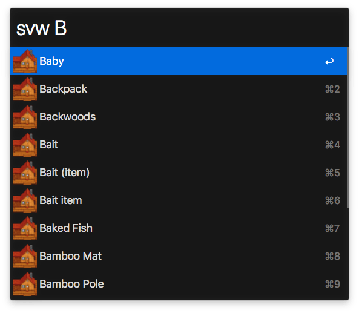

# Alfred Stardew Valley Wiki Workflow

Search Stardew Valley Wiki from the comfort of Alfred.



## Install

```sh
npm install --global alfred-stardewvalleywiki
```

*Requires [Node.js](https://nodejs.org) 4+ and the Alfred [Powerpack](https://www.alfredapp.com/powerpack/).*

## Usage

In Alfred, type `svw` then your query to search for Stardew Valley Wiki items.
Hit <kbd>Enter</kbd> to go to the items's Stardew Valley Wiki page.

## License

MIT © [Wes Baker](http://wesbaker.com)
